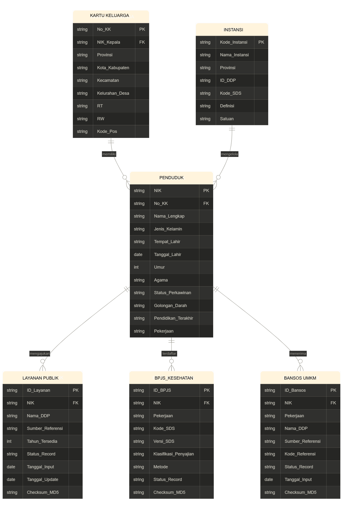

# Simulasi Backup dan Recovery Sistem Database - Dokumentasi Bulan 1

Capstone 11 (Kelompok 2) - Capstone Project  
Program Studi Ilmu Komputer IPB University 2026

## Deskripsi

Repositori ini berisi dokumentasi teknis lengkap untuk setup infrastruktur Bulan 1 proyek Capstone:

Simulasi Backup dan Recovery Sistem Database.

Tujuan Bulan 1 adalah membangun lingkungan simulasi dua site data center:
- Site A: Pusat Data Bogor (Primary Database)
- Site B: DRC (Replica Database)

Implementasi menggunakan VMware untuk virtual machine dan Docker PostgreSQL untuk database container.

## Prasyarat

- VMware Workstation Pro atau VMware Workstation Player
- ISO Ubuntu Server 24.04 LTS
- Koneksi internet (untuk instalasi paket)
- Dataset CSV kependudukan, contoh: `data.csv`

## Langkah 1 - Pembuatan Virtual Machine

### 1.1 Buat VM Master (Golden Image)

1. Buka VMware dan pilih Create New Virtual Machine.
2. Pilih Typical (recommended), lalu Next.
3. Pilih Installer disc image file (iso), lalu arahkan ke Ubuntu Server 24.04.
4. Isi form:
   - Full name: `Admin`
   - User name: `capstone11`
   - Password: `[password]`
   - Confirm: `[password]`
5. Isi Virtual machine name: `VM-MASTER-BACKUP`.
6. Tentukan Location sesuai folder penyimpanan.
7. Atur Maximum disk size: 30 GB dan pilih Store virtual disk as a single file.
8. Buka Customize Hardware:
   - Memory: 2048 MB (2 GB)
   - Processors: 2 cores
9. Klik Finish, lalu lanjutkan proses instalasi.

### 1.2 Instalasi Ubuntu Server

- Bahasa: English
- Saat update installer: Continue without updating
- Keyboard: English (US)
- Type of install: Ubuntu Server
- Network: default (DHCP)
- Proxy: kosong
- Mirror: default
- Storage: Use an entire disk -> Done -> Continue
- Profile:
  - Your name: `Admin`
  - Server name: `master`
  - Username: `capstone11`
  - Password: `[password]`
- SSH: centang Install OpenSSH server
- Snaps: kosongkan
- Tunggu instalasi selesai, lalu Reboot Now

### 1.3 Update dan Install Tools Dasar

Login sebagai `capstone11`, lalu jalankan:

```bash
sudo apt update && sudo apt upgrade -y
sudo apt install -y net-tools curl wget vim htop openssh-server
```

### 1.4 Matikan VM Master dan Clone

```bash
sudo shutdown -h now
```

Di VMware:
- Klik kanan `VM-MASTER-BACKUP` -> Manage -> Clone
- Pilih Linked Clone
- Buat clone bernama `VM-PRIMARY-BOGOR`
- Ulangi untuk `VM-REPLICA-DRC`

Catatan: VM Master dibiarkan mati sebagai template.

## Langkah 2 - Konfigurasi Jaringan Host-only

### 2.1 Atur Adapter Jaringan di VMware

Untuk masing-masing VM (Primary dan Replica):
- Klik kanan VM -> Settings -> Network Adapter
- Pilih Host-only (VMnet1)
- Centang Connect at power on

### 2.2 Setting IP Statis dengan Netplan

Nyalakan kedua VM.

Di VM Primary (`192.168.218.10`):

Cek nama interface:

```bash
ip a
```

Biasanya `ens33` atau `ens160`.

Edit netplan:

```bash
sudo nano /etc/netplan/50-cloud-init.yaml
```

Isi file (sesuaikan interface):

```yaml
network:
  version: 2
  ethernets:
    ens33:
      addresses:
        - 192.168.218.10/24
      nameservers:
        addresses: [8.8.8.8, 1.1.1.1]
```

Terapkan konfigurasi:

```bash
sudo netplan apply
```

Di VM Replica (`192.168.218.11`), lakukan langkah yang sama dan ganti IP menjadi `192.168.218.11/24`.

### 2.3 Verifikasi Koneksi

Dari Primary:

```bash
ping 192.168.218.11
```

Dari Replica:

```bash
ping 192.168.218.10
```

## Langkah 3 - Instalasi Docker dan Docker Compose

Catatan: Host-only tidak menyediakan akses internet. Ubah adapter sementara ke NAT untuk instalasi paket, lalu kembalikan ke Host-only.

### 3.1 Install Docker Engine

```bash
sudo apt update
sudo apt install docker.io -y
sudo systemctl enable docker --now
sudo usermod -aG docker $USER
newgrp docker
```

### 3.2 Install Docker Compose Plugin

```bash
sudo apt install docker-compose-plugin -y
```

Verifikasi:

```bash
docker --version
docker compose version
```

### 3.3 Kembalikan Adapter ke Host-only

Matikan VM, ubah adapter kembali ke Host-only, nyalakan VM dan terapkan konfigurasi kembali:

```bash
sudo netplan apply
```
Lalu cek IP dengan:

```bash
ip a
```

## Langkah 4 - Setup PostgreSQL dengan Docker Compose

### 4.1 Struktur Direktori

```bash
mkdir -p ~/pg-setup
cd ~/pg-setup
```

### 4.2 File `.env`

Buat file:

```bash
nano .env
```

Isi:

```env
POSTGRES_USER=admin
POSTGRES_PASSWORD=admin123
POSTGRES_DB=db_kependudukan
POSTGRES_PORT=5432
```

### 4.3 File `docker-compose.yml`

Buat file:

```bash
nano docker-compose.yml
```

Isi:

```yaml
version: '3.8'

services:
  pg-primary:
    image: postgres:15
    container_name: pg-primary
    env_file:
      - .env
    ports:
      - "${POSTGRES_PORT}:5432"
    volumes:
      - pgdata-primary:/var/lib/postgresql/data
    restart: always

volumes:
  pgdata-primary:
```

### 4.4 Jalankan Container

```bash
docker compose up -d
```

Verifikasi:

```bash
docker ps
docker exec -it pg-primary psql -U admin -d db_kependudukan
```

## Langkah 5 - Perancangan Database (ERD dan DDL)

### 5.1 ERD



Terdapat 6 tabel utama:
- `instansi` - data instansi pemerintah
- `kartu_keluarga` - data kartu keluarga
- `penduduk` - data utama penduduk (FK ke `kartu_keluarga`)
- `layanan_publik` - pengajuan layanan publik (FK ke `penduduk`)
- `bpjs_kesehatan` - data kepesertaan BPJS (FK ke `penduduk`)
- `bansos_umkm` - data penerima bantuan sosial (FK ke `penduduk`)

## Langkah 6 - Skrip Inisialisasi Database Otomatis (`init-db.sh`)

Skrip ini mengotomasi proses inisialisasi database.

Script: [scripts/init-db.sh](./scripts/init-db.sh)

### 6.1 Menjalankan Skrip

Simpan `init-db.sh` di direktori `~/pg-setup`, lalu jalankan:

```bash
chmod +x init-db.sh
./init-db.sh
```

### 6.2 Alur Skrip

1. Reset tabel (drop cascade bila tabel sudah ada).
2. Membuat database tambahan: `db_full`, `db_inc`, `db_diff`.
3. Membuat tabel utama dan tabel staging.
4. Import CSV (jika file tersedia), lalu transformasi data.
5. Jika CSV tidak ada, generate data dummy dengan `generate_series()`.
6. Verifikasi jumlah data pada setiap tabel.

## Langkah 7 - Verifikasi Akhir

### 7.1 Cek Jumlah Data per Tabel

Contoh output:

```text
    tabel           | jumlah
--------------------+--------
 instansi           |     50
 kartu_keluarga     |  10000
 penduduk           |  10000
 bpjs_kesehatan     |  10000
 layanan_publik     |  15000
 bansos_umkm        |  12000
 staging_csv        |      0
```

### 7.2 Uji Koneksi Antar VM

```bash
# Dari host
ping 192.168.218.10
ping 192.168.218.11
```

### 7.3 Cek Status Container

```bash
docker ps
docker logs pg-primary
```

## Troubleshooting

| Masalah | Solusi |
|---|---|
| Subnet VMnet1 berbeda (`192.168.56.x` vs `192.168.218.x`) | Sesuaikan IP statis netplan dengan subnet VMnet1 host |
| Disk VM penuh saat import CSV | Lakukan extend LVM (`growpart`, `pvresize`, `lvextend`, `resize2fs`) |
| Linked Clone tidak bisa expand disk langsung | Gunakan resize berbasis LVM |
| NIK mengandung `.0` di CSV | Gunakan `REGEXP_REPLACE(nik, '\\.0$', '')` |
| Format tanggal campuran (`MM/DD/YYYY` dan `YYYY-MM-DD`) | Buat fungsi parser tanggal khusus |
| Foreign key violation saat insert tabel turunan | Filter data dengan parent key valid (`WHERE nik IN (...)`) |
| Tidak bisa paste ke terminal VM dari GUI | Gunakan SCP dari PowerShell host |
| Salah ketik image Docker (`posgres`) | Koreksi menjadi `postgres:15` |
